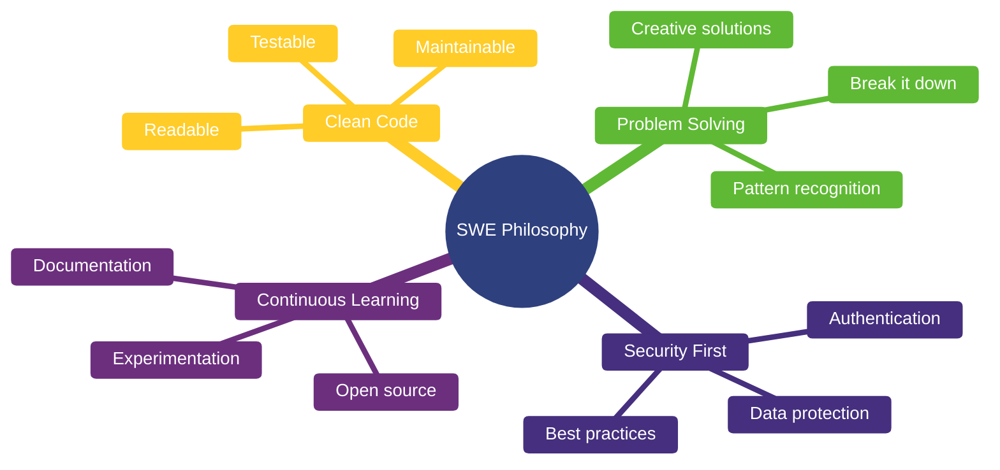
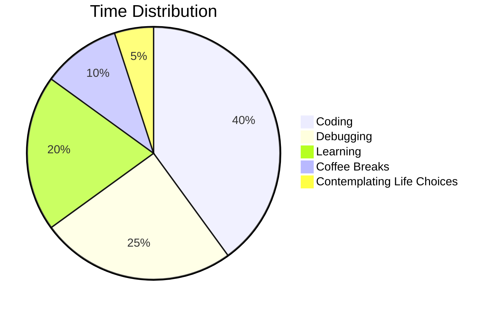

# ✨ It's not a bug, it's a feature ✨

---

I'm **Mohamed Thabet**, a software engineer in the making who believes every problem is just a puzzle waiting to be solved. My journey started with a simple "Hello World" and evolved into building systems that actually matter.

**What drives me?** The satisfaction of watching clean code compile, the thrill of solving complex problems, and the impact of creating something that makes life easier for others.

---

## 🧠 My Engineering Mindset

## 💻 My Tech Toolkit

**Backend** → PHP • Laravel • Python • Django  
**Database** → MySQL • MongoDB • Redis  
**DevOps** → Git • Docker • Linux/Bash  
**Tools** → Postman • VSCode • Figma

*But here's the truth: Tools change, principles don't. I focus on software engineering fundamentals that transcend any specific technology.*

---

### 💭 *"First, solve the problem. Then, write the code."* – John Johnson

**Made with 💙 and probably too much caffeine**  
⭐️ From [MohamedThabt](https://github.com/MohamedThabt)

