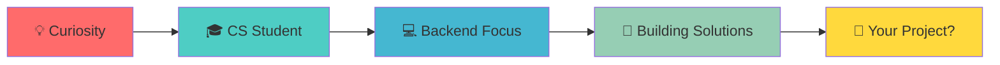
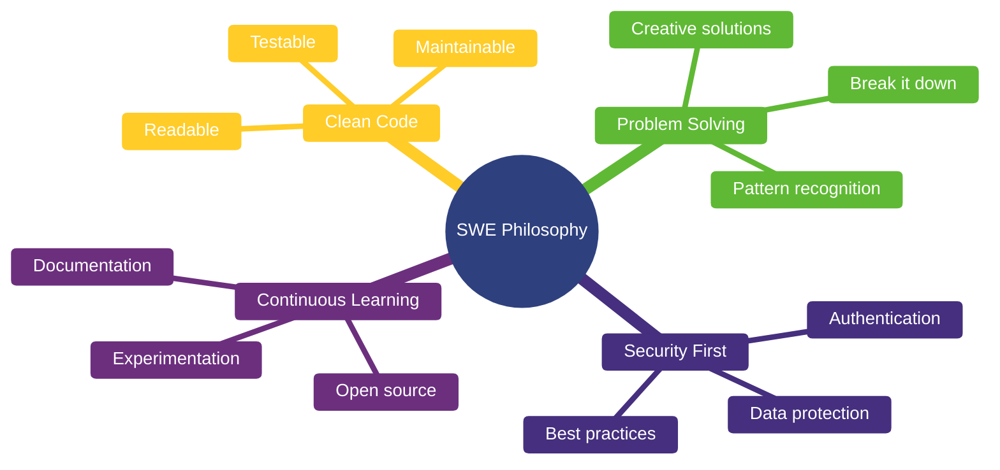
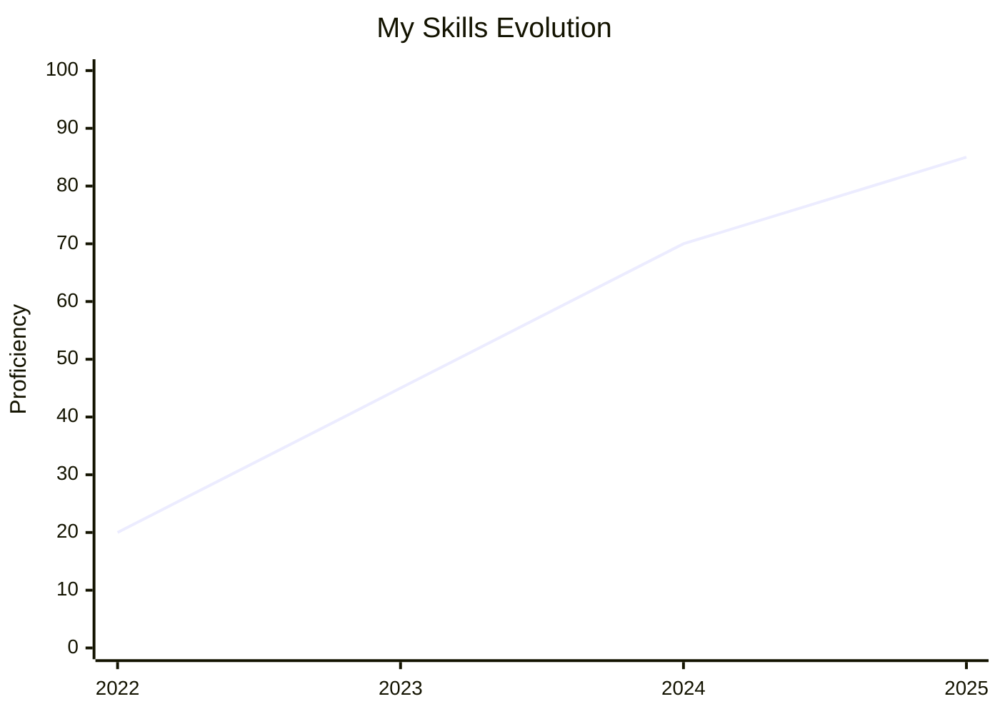
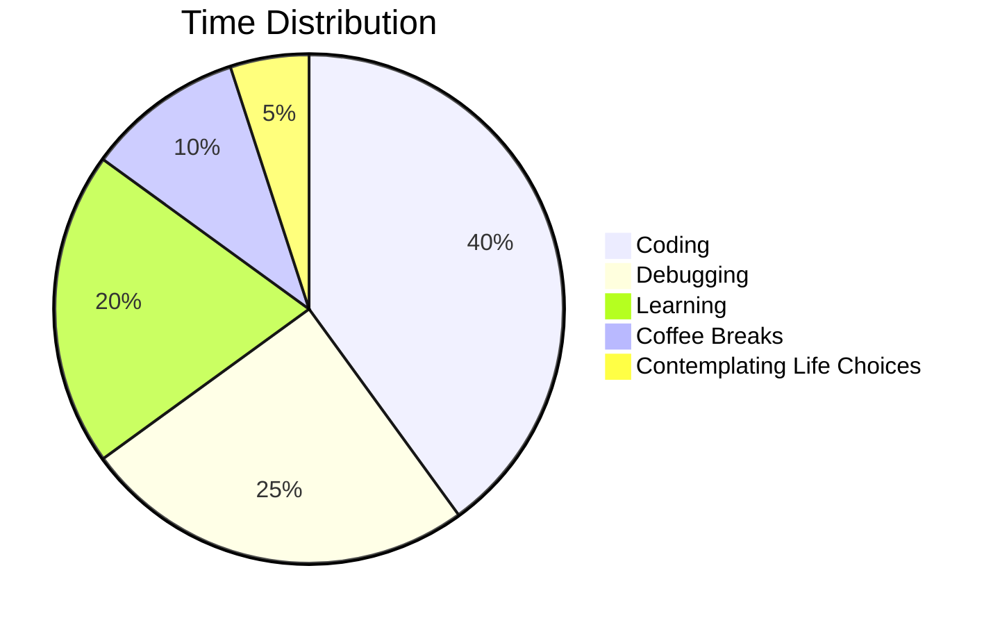

<div align="center">

# ✨ It's not a bug, it's a feature ✨


</div>

---

## 🎭 The Story So Far...



I'm **Mohamed Thabet**, a software engineer in the making who believes every problem is just a puzzle waiting to be solved. My journey started with a simple "Hello World" and evolved into building systems that actually matter.

**What drives me?** The satisfaction of watching clean code compile, the thrill of solving complex problems, and the impact of creating something that makes life easier for others.

---

## 🧠 My Engineering Mindset



---

## 🎯 Current Quest

**🎓 Currently Mastering:**
- Building RESTful APIs that developers love to use
- Implementing authentication systems that actually work
- Designing database schemas that scale
- Writing code that my future self won't curse at

---

## 💻 My Tech Toolkit

<div align="center">

**Backend** → PHP • Laravel • Python • Django  
**Database** → MySQL • MongoDB • Redis  
**DevOps** → Git • Docker • Linux/Bash  
**Tools** → Postman • VSCode • Figma

*But here's the truth: Tools change, principles don't. I focus on software engineering fundamentals that transcend any specific technology.*

</div>

---

## 🏗️ Architecture Philosophy

I believe in:
- **Separation of Concerns** → Each component does one thing well
- **DRY Principle** → Don't repeat yourself (or others)
- **SOLID Principles** → The foundation of maintainable code
- **Security by Design** → Not an afterthought, but a core feature
- **Test-Driven Development** → Because bugs are expensive

---

## 📈 Growth Trajectory



**2022** → Started with basics, fell in love with problem-solving  
**2023** → Dove into backend development, discovered Laravel  
**2024** → Focused on security, API design, and clean architecture  
**2025** → Building production-ready systems, exploring microservices
---

## 🎨 The Creative Side

I don't just write code—I craft solutions. Every API endpoint is a conversation, every database schema tells a story, and every security layer is a fortress protecting user trust.

```
┌─────────────────────────────────────────┐
│  while (alive) {                        │
│    eat();                               │
│    sleep();                             │
│    code();                              │
│    repeat();                            │
│  }                                      │
└─────────────────────────────────────────┘
```

---

## 🤝 Let's Build Something Amazing

I'm always open to:
- 🚀 Collaborating on interesting projects
- 💬 Discussing software architecture and design patterns
- 🔒 Exploring web security challenges
- 🌱 Learning from experienced developers

<div align="center">
  
  [](https://www.linkedin.com/in/mohamed-thabet-5694462a0)
  [](https://twitter.com/Mohamed13546660)
  
</div>

---

<div align="center">

### 💭 *"First, solve the problem. Then, write the code."* – John Johnson




**Made with 💙 and probably too much caffeine**  
⭐️ From [MohamedThabt](https://github.com/MohamedThabt)

</div>
